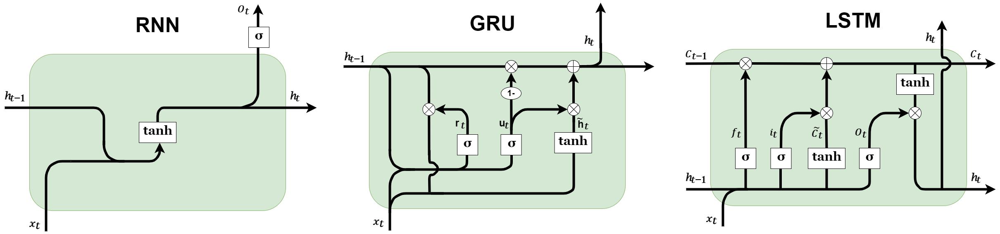
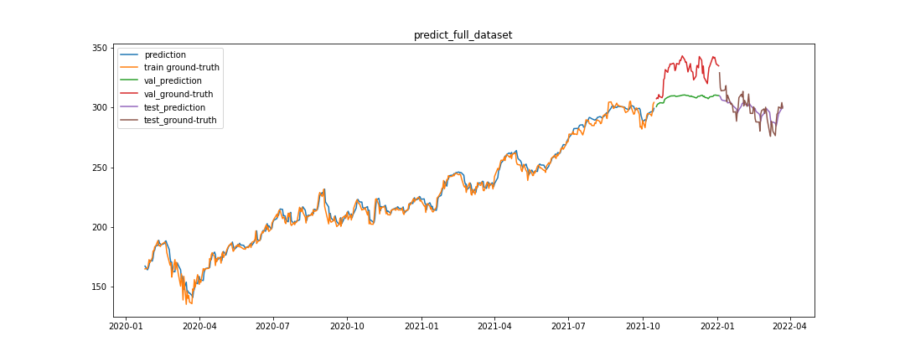

### predict-series-data-with-RNN

Apply these RNN models to predict series data, In this application the values in previous time become the input for next prediction.

Microsoft-stock-prediction

**Notes**

||||
|---|---|---|
|input dataset `X`| input of model `(number_of_samples,seq_len,input_dim)`|(545,5,1)|
|label dataset `Y`| label of these input `(number_of_samples,output_dim)`|(545,1)|
|`number_of_samples`| how many sample in your dataset ()|545|
|`seq_len`| how many previous samples you want to look back|5|
|`input_dim`| your input dimension|1|
|`output_dim`| your output dimension|1|

### references

[Stock Price Prediction & Forecasting with LSTM Neural Networks in Python](https://www.youtube.com/watch?v=CbTU92pbDKw&t=492s)

[Stock Price Prediction & Forecasting with LSTM Neural Networks in Python-colab](https://colab.research.google.com/drive/1Bk4zPQwAfzoSHZokKUefKL1s6lqmam6S?usp=sharing)

[LSTM Time Series Forecasting Tutorial in Python](https://www.youtube.com/watch?v=c0k-YLQGKjY)

[Flask Application for Uploading Excel/CSV Files](https://www.youtube.com/watch?v=tJKHrLzcopo)

[Uploading CSV/Excel file and Obtaining Plots inside Python Flask](https://www.youtube.com/watch?v=BAngpMIaZvM)

[Upload CSV File with SQLite Database Using Flask | Tamil](https://www.youtube.com/watch?v=YNzRBjW_HR4&t=215s)

[Predicting the Stock Market with Machine Learning (Part 1) - Data Preparation](https://www.youtube.com/watch?v=Hf-c4Y3OZnk&list=PLGxQQ15B6f3u3rNGzaBqvTd8g7PGTd2jO&index=1)

