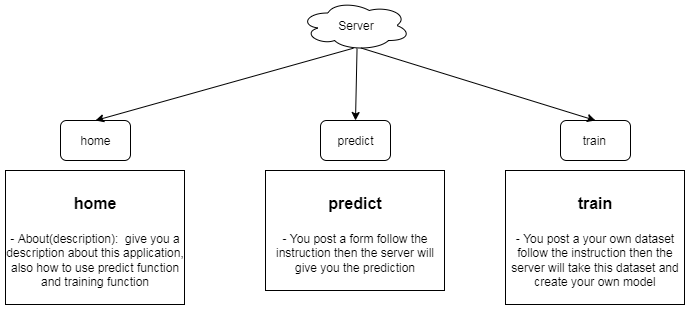

### description

Microsoft-stock-prediction. Apply the RNN models to predict series data, buidling a web-application to predict input data and you can create your own model by training your custom dataset .In this application the values in previous time become the input for next prediction.

Application functional hierarchy diagram

**(✳)Notes-machine_learning**

||description|default value|
|---|---|---|
|input dataset `X`| input of model `(number_of_samples,seq_len,input_dim)`|(545,5,1)|
|label dataset `Y`| label of these input `(number_of_samples,output_dim)`|(545,1)|
|`number_of_samples`| how many sample in your dataset ()|545|
|`seq_len`| how many previous samples you want to look back|5|
|`input_dim`| your input dimension|1|
|`output_dim`| your output dimension|1|

**(✳)Notes-application**

- run this app: `python app.py`

- check api docs: `http://127.0.0.1:5000/apidocs/`

### tools

|No|tool|descript|
|---|---|---|
|1|[sublime-text](https://www.sublimetext.com/)|code editor|
|2|[jupyter-notebook](https://jupyter.org/)|build machine learning model|
|3|[diagrameditor](https://www.diagrameditor.com/)|drawing UML|
|4|[pixlr](https://pixlr.com/vn/x/)|design banner|
|5|[github](https://github.com/)|cloud platform for manager your project|
|6|[git](https://git-scm.com/)|control your repository|

### references

[Stock Price Prediction & Forecasting with LSTM Neural Networks in Python](https://www.youtube.com/watch?v=CbTU92pbDKw&t=492s)

[Stock Price Prediction & Forecasting with LSTM Neural Networks in Python-colab](https://colab.research.google.com/drive/1Bk4zPQwAfzoSHZokKUefKL1s6lqmam6S?usp=sharing)

[LSTM Time Series Forecasting Tutorial in Python](https://www.youtube.com/watch?v=c0k-YLQGKjY)

[Flask Application for Uploading Excel/CSV Files](https://www.youtube.com/watch?v=tJKHrLzcopo)

[Uploading CSV/Excel file and Obtaining Plots inside Python Flask](https://www.youtube.com/watch?v=BAngpMIaZvM)

[Upload CSV File with SQLite Database Using Flask | Tamil](https://www.youtube.com/watch?v=YNzRBjW_HR4&t=215s)

[Predicting the Stock Market with Machine Learning (Part 1) - Data Preparation](https://www.youtube.com/watch?v=Hf-c4Y3OZnk&list=PLGxQQ15B6f3u3rNGzaBqvTd8g7PGTd2jO&index=1)