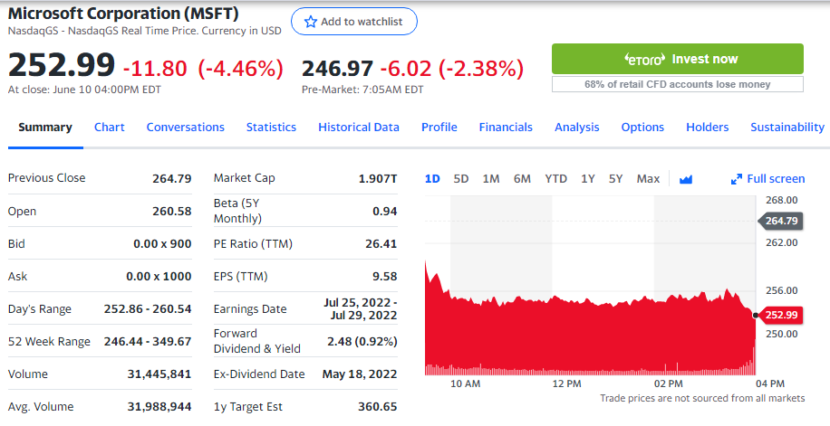
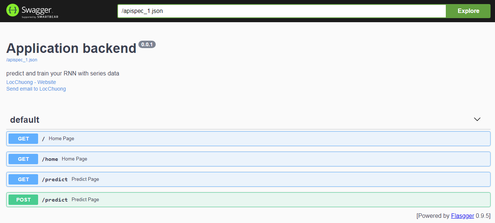
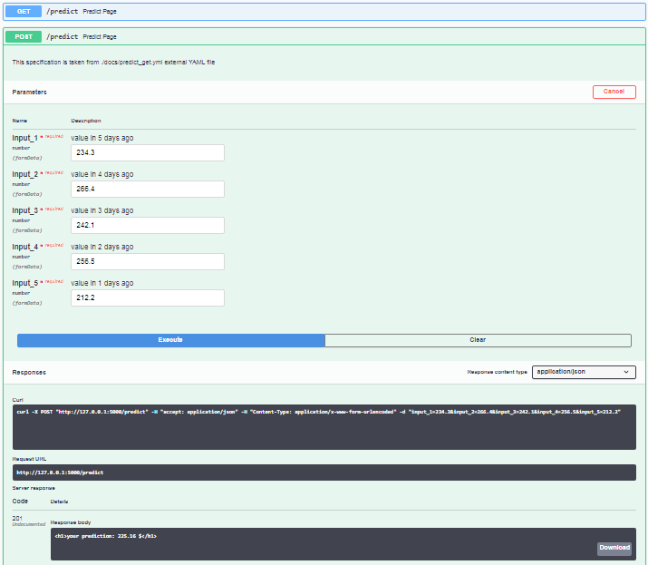
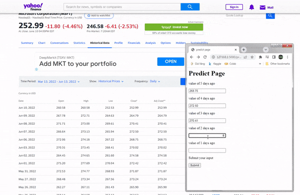

 

### description

Microsoft-stock-prediction. Apply the deep learning RNN models to predict series data, buidling a web-application to predict input data and you can also create your own model for predict your custom dataset .In this application the values in previous time become the input for next prediction.

- Application functional hierarchy diagram

- Appication apidocs

- You can also test your `request` with swagger-flassger apidocs `GUI`

Get the 5 lastest day's values

**✳ Notes-machine_learning**

||description|default value|
|---|---|---|
|input dataset `X`| input of model `(number_of_samples,seq_len,input_dim)`|(545,5,1)|
|label dataset `Y`| label of these input `(number_of_samples,output_dim)`|(545,1)|
|`number_of_samples`| how many sample in your dataset ()|545|
|`seq_len`| how many previous samples you want to look back|5|
|`input_dim`| your input dimension|1|
|`output_dim`| your output dimension|1|

**✳ Notes-application**

- run this app: `python app.py`

- check api docs: `http://127.0.0.1:5000/apidocs/`

### release-note
|version|description|date|
|---|---|---|
|v0.1|. building model ☑    . predict function ☑   . flasgger-apidocs ❌|14|
|v0.2|. train your own model ❌|

### tools

|No|tool|descript|
|---|---|---|
|1|[sublime-text](https://www.sublimetext.com/)|code editor|
|2|[jupyter-notebook](https://jupyter.org/)|build machine learning model|
|3|[diagrameditor](https://www.diagrameditor.com/)|drawing UML|
|4|[pixlr](https://pixlr.com/vn/x/)|design banner|
|5|[github](https://github.com/)|cloud platform for manager your project|
|6|[git](https://git-scm.com/)|control your repository|
|7|[ezgif](https://ezgif.com/maker)|ezgif maker|
|8|[symbolcopy](https://www.symbolcopy.com/)|get sympol character|
|9|[shields](https://shields.io/)|create your own git badges|

### references

[Stock Price Prediction & Forecasting with LSTM Neural Networks in Python](https://www.youtube.com/watch?v=CbTU92pbDKw&t=492s)

[Stock Price Prediction & Forecasting with LSTM Neural Networks in Python-colab](https://colab.research.google.com/drive/1Bk4zPQwAfzoSHZokKUefKL1s6lqmam6S?usp=sharing)

[LSTM Time Series Forecasting Tutorial in Python](https://www.youtube.com/watch?v=c0k-YLQGKjY)

[Flask Application for Uploading Excel/CSV Files](https://www.youtube.com/watch?v=tJKHrLzcopo)

[Uploading CSV/Excel file and Obtaining Plots inside Python Flask](https://www.youtube.com/watch?v=BAngpMIaZvM)

[Upload CSV File with SQLite Database Using Flask | Tamil](https://www.youtube.com/watch?v=YNzRBjW_HR4&t=215s)

[Predicting the Stock Market with Machine Learning (Part 1) - Data Preparation](https://www.youtube.com/watch?v=Hf-c4Y3OZnk&list=PLGxQQ15B6f3u3rNGzaBqvTd8g7PGTd2jO&index=1)
